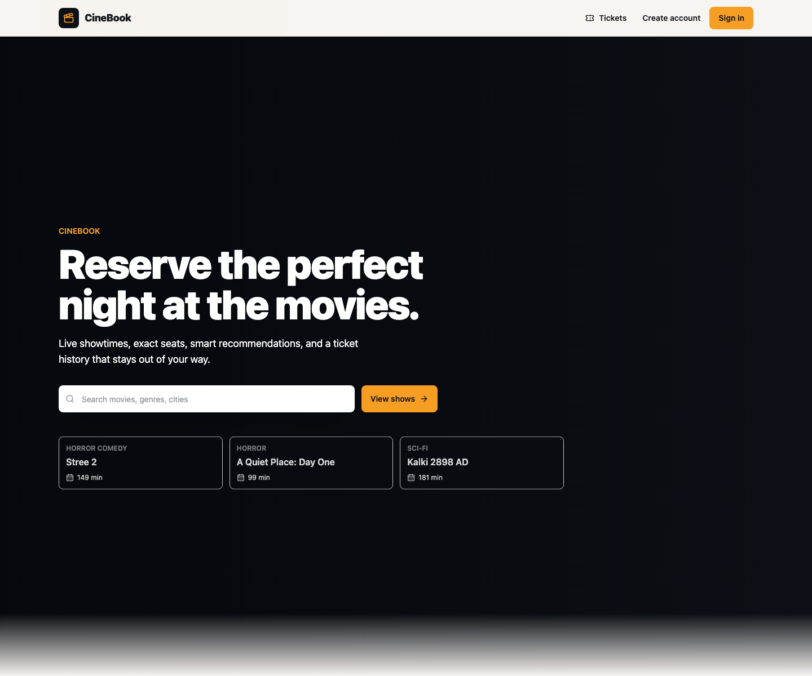
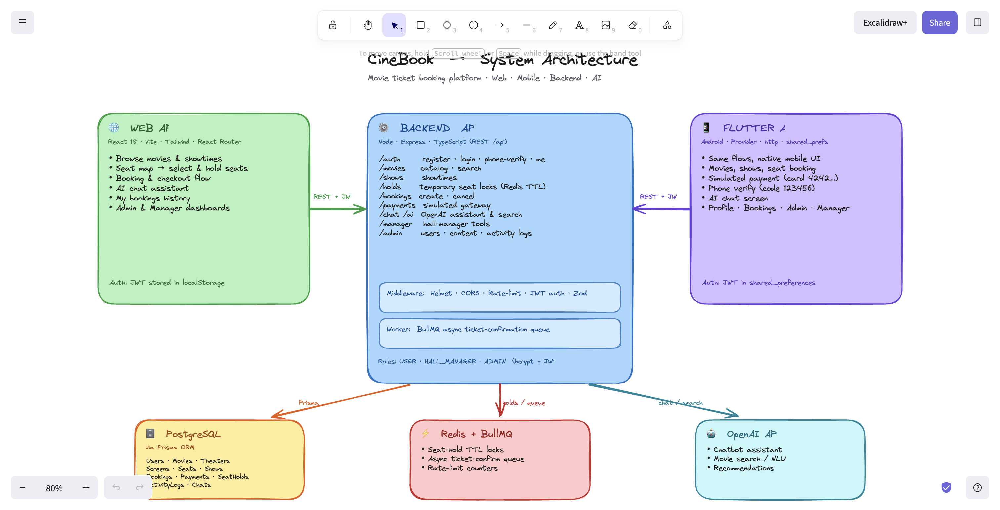

# CineBook



CineBook is a full-stack movie ticket booking app for discovering movies, checking live showtimes, choosing seats, placing short seat holds, paying for tickets, and managing bookings.

## Features

- Browse movies by city, genre, theatre chain, format, language, rating, and release date.
- View showtimes, seat layouts, availability, and prices.
- Hold selected seats before checkout to avoid double booking.
- Simulated payments, booking history, cancellations, and refunds.
- AI movie recommendations and a booking assistant chatbot.
- Admin and hall-manager flows for users, theatres, screens, shows, reports, and scheduling.

## Architecture Diagram



## Tech Stack

React, TypeScript, Vite, Tailwind CSS, Node.js, Express, Prisma, PostgreSQL, Redis, BullMQ, Docker, and OpenAI.

## Starter Guide

Install dependencies:

```bash
cd backend
npm install
npm --prefix ../frontend install
```

Copy the backend environment file:

```bash
cp .env.example .env
```

Start the backend stack:

```bash
npm run docker:up
```

Start the frontend in another terminal:

```bash
cd backend
npm run dev:frontend
```

Open `http://localhost:5174`.

## Docker

The Docker setup lives in `backend/docker-compose.yml` and starts PostgreSQL, Redis, the API, and the ticket worker:

```bash
cd backend
docker compose up --build
```

## Demo Accounts

- `admin@cinebook.local` / `Admin@123`
- `manager@cinebook.local` / `Manager@123`
- `demo@cinebook.local` / `Demo@123`
